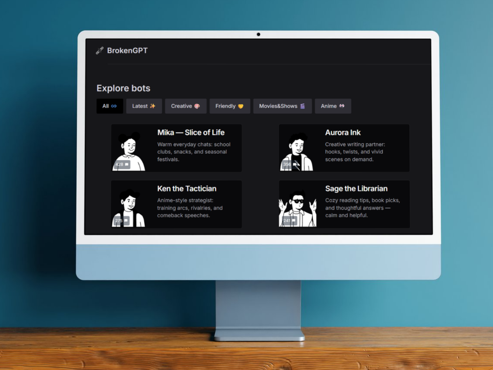
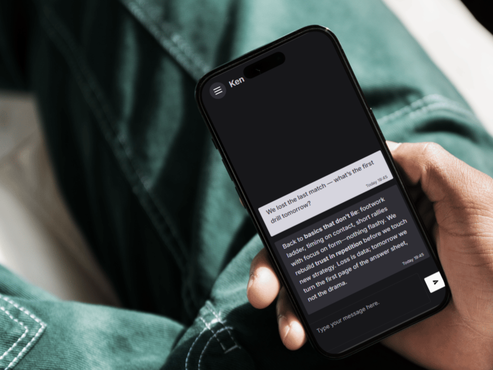
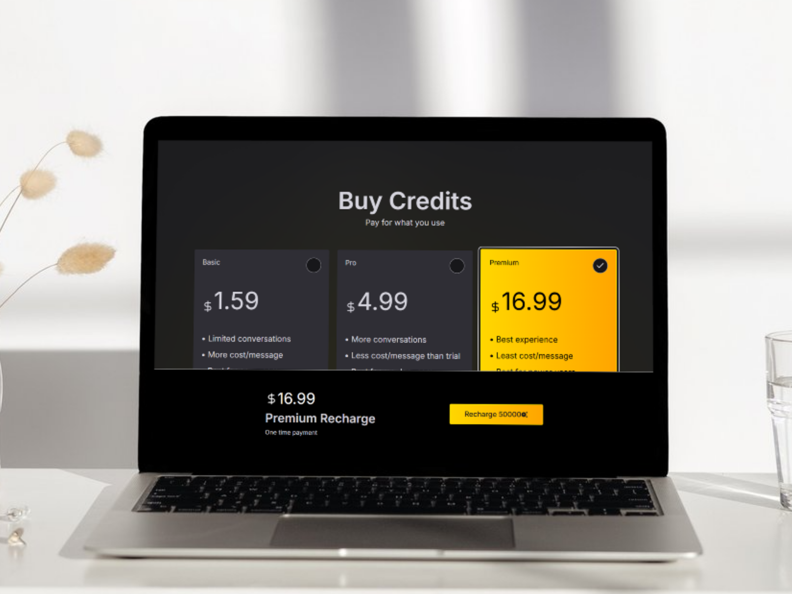

# BrokenGPT

**Chat with custom AI characters** — a full-stack AI chat platform where each conversation feels like a distinct persona, not a generic assistant.

  

---

## What is BrokenGPT?

BrokenGPT is an AI chat product built around **characters**: curated personas (for example a **psychiatrist**, **librarian**, or **friend**) and **user-defined characters** with custom instructions, tone, and behaviour. You pick who you are talking to; the model stays in character while answering through **AWS Bedrock**.

The product uses a **credit (token) system**: new accounts receive a starting balance of free tokens. When credits run low, users can **purchase more** through the **PayPal** payment gateway, keeping hosting and model costs sustainable.

---

## Highlights

| Area | Description |
|------|-------------|
| **Predefined characters** | Ready-made roles so users can start chatting immediately with consistent personalities. |
| **Custom characters** | Define your own name, system prompt, and style so the AI behaves the way you want. |
| **Credits** | Token-based metering from sign-up through paid top-ups. |
| **Payments** | PayPal integration for buying credit packs after free allocation is used. |
| **Modern UI** | **React**, **Vite**, **TypeScript**, and **Tailwind CSS** for a fast, responsive client. |
| **Backend** | **Python** and **Flask** orchestrate auth, billing, character data, and calls to Bedrock. |

---

## Screenshots

All images below live in [`demos/`](demos/).

### Chat

Conversations stay scoped to the active character; the backend talks to **AWS Bedrock** for generation.

  

### Credits and PayPal

Free tokens at sign-up, then **PayPal** when users need more capacity.

  

The **React** client talks to a **Flask** backend for sessions, characters, and credits; the API calls **AWS Bedrock** for model output and **PayPal** for purchases.

---

## Tech stack

  
  
  
  
  
  
  
  

---

